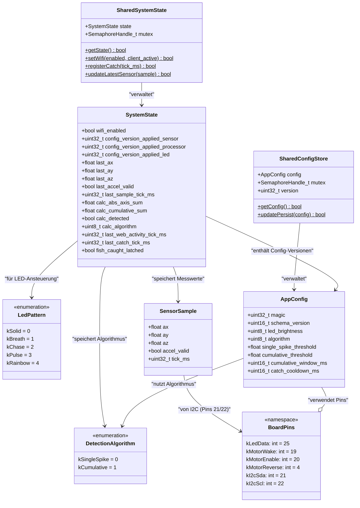

# Fishy Catchy – Datenstrukturen Klassendiagramm

Detailliertes Klassendiagramm mit allen Datenstrukturen, deren Attributen und Beziehungen.

```mermaid
classDiagram
    direction TB

    %% Konfiguration und Enums
    class BoardPins {
        <<namespace>>
        kLedData: int = 25
        kMotorWake: int = 19
        kMotorEnable: int = 20
        kMotorReverse: int = 4
        kI2cSda: int = 21
        kI2cScl: int = 22
    }

    class DetectionAlgorithm {
        <<enumeration>>
        kSingleSpike = 0
        kCumulative = 1
    }

    class LedPattern {
        <<enumeration>>
        kSolid = 0
        kBreath = 1
        kChase = 2
        kPulse = 3
        kRainbow = 4
    }

    %% Datenstrukturen
    class AppConfig {
        +uint32_t magic
        +uint16_t schema_version
        +uint8_t led_brightness
        +uint8_t algorithm
        +float single_spike_threshold
        +float cumulative_threshold
        +uint16_t cumulative_window_ms
        +uint16_t catch_cooldown_ms
    }

    class SensorSample {
        +float ax
        +float ay
        +float az
        +bool accel_valid
        +uint32_t tick_ms
    }

    class SystemState {
        +bool wifi_enabled
        +uint32_t config_version_applied_sensor
        +uint32_t config_version_applied_processor
        +uint32_t config_version_applied_led
        +float last_ax
        +float last_ay
        +float last_az
        +bool last_accel_valid
        +uint32_t last_sample_tick_ms
        +float calc_abs_axis_sum
        +float calc_cumulative_sum
        +bool calc_detected
        +uint8_t calc_algorithm
        +uint32_t last_web_activity_tick_ms
        +uint32_t last_catch_tick_ms
        +bool fish_caught_latched
    }

    %% Shared Stores mit Mutex
    class SharedConfigStore {
        +AppConfig config
        +SemaphoreHandle_t mutex
        +uint32_t version
        +getConfig()$ bool
        +updatePersist(config)$ bool
    }

    class SharedSystemState {
        +SystemState state
        +SemaphoreHandle_t mutex
        +getState()$ bool
        +setWifi(enabled, client_active)$ bool
        +registerCatch(tick_ms)$ bool
        +updateLatestSensor(sample)$ bool
    }

    %% Beziehungen
    AppConfig --o BoardPins : "verwendet Pins"
    AppConfig --> DetectionAlgorithm : "nutzt Algorithmus"
    
    SensorSample --> BoardPins : "von I2C (Pins 21/22)"
    
    SystemState --> AppConfig : "enthält Config-Versionen"
    SystemState --> DetectionAlgorithm : "speichert Algorithmus"
    SystemState --> SensorSample : "speichert Messwerte"
    SystemState --> LedPattern : "für LED-Ansteuerung"
    
    SharedConfigStore --> AppConfig : "verwaltet"
    SharedSystemState --> SystemState : "verwaltet"
    
    classDef store fill:#fff4e6,stroke:#f08c00,stroke-width:2px,color:#663c00
    classDef datatype fill:#ebfbee,stroke:#2b8a3e,stroke-width:2px,color:#1f4d2a
    classDef enum fill:#e7f5ff,stroke:#1c7ed6,stroke-width:2px,color:#0b3b66
    classDef boardPins fill:#f3f0ff,stroke:#7950f2,stroke-width:2px,color:#4a148c
```
