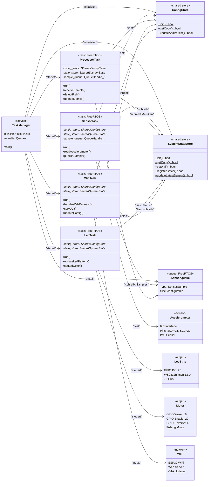

# Fishy Catchy – Komponenten & Architektur Diagramm

Zeigt die Komponenten, deren Abhängigkeiten und wie sie zusammenwirken.

```mermaid
classDiagram
    direction LR

    %% Task-Komponenten
    class TaskManager {
        <<service>>
        main()
        initialisiert alle Tasks
        verwaltet Queues
    }

    class SensorTask {
        <<task: FreeRTOS>>
        -config_store: SharedConfigStore*
        -state_store: SharedSystemState*
        -sample_queue: QueueHandle_t
        +run()
        +readAccelerometer()
        +publishSample()
    }

    class ProcessorTask {
        <<task: FreeRTOS>>
        -config_store: SharedConfigStore*
        -state_store: SharedSystemState*
        -sample_queue: QueueHandle_t
        +run()
        +receiveSample()
        +detectFish()
        +updateMetrics()
    }

    class LedTask {
        <<task: FreeRTOS>>
        -config_store: SharedConfigStore*
        -state_store: SharedSystemState*
        +run()
        +updateLedPattern()
        +setLedColor()
    }

    class WifiTask {
        <<task: FreeRTOS>>
        -config_store: SharedConfigStore*
        -state_store: SharedSystemState*
        +run()
        +handleWebRequest()
        +serveUI()
        +updateConfig()
    }

    %% Shared Resources
    class ConfigStore {
        <<shared store>>
        +init()$ bool
        +getCopy()$ bool
        +updateAndPersist()$ bool
    }

    class SystemStateStore {
        <<shared store>>
        +init()$ bool
        +getCopy()$ bool
        +setWifi()$ bool
        +registerCatch()$ bool
        +updateLatestSensor()$ bool
    }

    class SensorQueue {
        <<queue: FreeRTOS>>
        Type: SensorSample
        Size: configurable
    }

    %% Peripherie
    class Accelerometer {
        <<sensor>>
        I2C Interface
        Pins: SDA=21, SCL=22
        IMU Sensor
    }

    class LedStrip {
        <<output>>
        GPIO Pin: 25
        WS2812B RGB LED
        7 LEDs
    }

    class Motor {
        <<output>>
        GPIO Wake: 19
        GPIO Enable: 20
        GPIO Reverse: 4
        Fishing Motor
    }

    class WiFi {
        <<network>>
        ESP32 WiFi
        Web Server
        OTA Updates
    }

    %% Abhängigkeiten
    TaskManager --> SensorTask : "startet"
    TaskManager --> ProcessorTask : "startet"
    TaskManager --> LedTask : "startet"
    TaskManager --> WifiTask : "startet"
    TaskManager --> ConfigStore : "initialisiert"
    TaskManager --> SystemStateStore : "initialisiert"
    TaskManager --> SensorQueue : "erstellt"

    SensorTask --> ConfigStore : "liest"
    SensorTask --> SystemStateStore : "schreibt"
    SensorTask --> SensorQueue : "schreibt Samples"
    SensorTask --> Accelerometer : "liest"

    ProcessorTask --> ConfigStore : "liest"
    ProcessorTask --> SystemStateStore : "schreibt Metriken"
    ProcessorTask --> SensorQueue : "liest Samples"

    LedTask --> ConfigStore : "liest"
    LedTask --> SystemStateStore : "liest Status"
    LedTask --> LedStrip : "steuert"
    LedTask --> Motor : "steuert"

    WifiTask --> ConfigStore : "liest/schreibt"
    WifiTask --> SystemStateStore : "liest/schreibt"
    WifiTask --> WiFi : "nutzt"

    classDef task fill:#c8e6c9,stroke:#2e7d32,stroke-width:2px,color:#1b5e20
    classDef store fill:#ffecb3,stroke:#f57f17,stroke-width:2px,color:#e65100
    classDef queue fill:#bbdefb,stroke:#1565c0,stroke-width:2px,color:#0d47a1
    classDef hardware fill:#f8bbd0,stroke:#c2185b,stroke-width:2px,color:#880e4f
    classDef service fill:#ece7f6,stroke:#512da8,stroke-width:2px,color:#311b92
```
