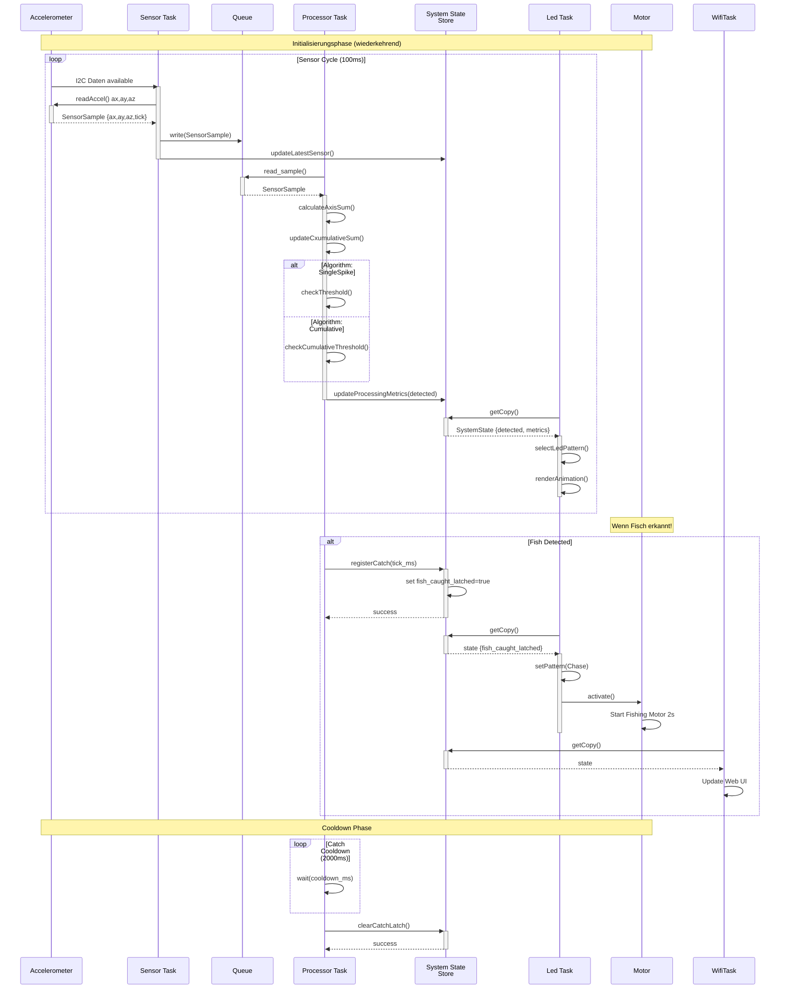

# Fishy Catchy – Sequenzdiagramm: Fisch-Erkennung

Zeigt die Abläufe und Kommunikation zwischen den Tasks während einer Fisch-Erkennung.

```mermaid
sequenceDiagram
    participant Accelerometer
    participant SensorTask as Sensor Task
    participant SensorQueue as Queue
    participant ProcessorTask as Processor Task
    participant StateStore as System State<br/>Store
    participant LedTask as Led Task
    participant Motor

    note over Accelerometer,Motor: Initialisierungsphase (wiederkehrend)
    
    loop Sensor Cycle (100ms)
        Accelerometer->>SensorTask: I2C Daten available
        activate SensorTask
        SensorTask->>+Accelerometer: readAccel() ax,ay,az
        Accelerometer-->>-SensorTask: SensorSample {ax,ay,az,tick}
        SensorTask->>SensorQueue: write(SensorSample)
        SensorTask->>StateStore: updateLatestSensor()
        deactivate SensorTask
        
        ProcessorTask->>+SensorQueue: read_sample()
        SensorQueue-->>-ProcessorTask: SensorSample
        activate ProcessorTask
        ProcessorTask->>ProcessorTask: calculateAxisSum()
        ProcessorTask->>ProcessorTask: updateCxumulativeSum()
        
        alt Algorithm: SingleSpike
            ProcessorTask->>ProcessorTask: checkThreshold()
        else Algorithm: Cumulative
            ProcessorTask->>ProcessorTask: checkCumulativeThreshold()
        end
        
        ProcessorTask->>StateStore: updateProcessingMetrics(detected)
        deactivate ProcessorTask
        
        LedTask->>+StateStore: getCopy()
        StateStore-->>-LedTask: SystemState {detected, metrics}
        activate LedTask
        LedTask->>LedTask: selectLedPattern()
        LedTask->>LedTask: renderAnimation()
        deactivate LedTask
    end

    note over Motor: Wenn Fisch erkannt!
    
    alt Fish Detected
        ProcessorTask->>+StateStore: registerCatch(tick_ms)
        StateStore->>StateStore: set fish_caught_latched=true
        StateStore-->>-ProcessorTask: success
        
        LedTask->>+StateStore: getCopy()
        StateStore-->>-LedTask: state {fish_caught_latched}
        activate LedTask
        LedTask->>LedTask: setPattern(Chase)
        LedTask->>Motor: activate()
        Motor->>Motor: Start Fishing Motor 2s
        deactivate LedTask
        
        WifiTask->>+StateStore: getCopy()
        StateStore-->>-WifiTask: state
        WifiTask->>WifiTask: Update Web UI
    end

    note over Accelerometer,Motor: Cooldown Phase
    loop Catch Cooldown (2000ms)
        ProcessorTask->>ProcessorTask: wait(cooldown_ms)
    end
    
    ProcessorTask->>+StateStore: clearCatchLatch()
    StateStore-->>-ProcessorTask: success
```
