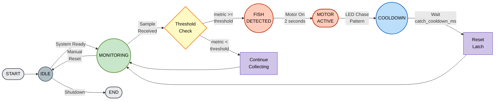

# Fishy Catchy – Zustandsmaschine: Erkennungslogik

Zeigt die Zustände des Erkennungssystems und die Übergänge zwischen ihnen mit klaren Kreisen und Verbindungen.

```mermaid
graph LR
    START(["START"]) --> IDLE(("IDLE"))
    
    IDLE -->|System Ready| MONITORING(("MONITORING"))
    
    MONITORING -->|Sample<br/>Received| EVALUATE{"Threshold<br/>Check"}
    
    EVALUATE -->|metric >=<br/>threshold| DETECTED(("FISH<br/>DETECTED"))
    EVALUATE -->|metric &lt;<br/>threshold| CONTINUE["Continue<br/>Collecting"]
    CONTINUE --> MONITORING
    
    DETECTED -->|Motor On<br/>2 seconds| MOTOR(["MOTOR<br/>ACTIVE"])
    MOTOR -->|LED Chase<br/>Pattern| COOLDOWN(("COOLDOWN"))
    
    COOLDOWN -->|Wait<br/>catch_cooldown_ms| RESET["Reset<br/>Latch"]
    RESET --> MONITORING
    
    MONITORING -->|Manual<br/>Reset| IDLE
    IDLE -->|Shutdown| END(["END"])
    
    style START fill:#e8eaed,stroke:#5f6368,stroke-width:2px,color:#000
    style END fill:#e8eaed,stroke:#5f6368,stroke-width:2px,color:#000
    style IDLE fill:#b0bec5,stroke:#455a64,stroke-width:2px,color:#000
    style MONITORING fill:#c8e6c9,stroke:#558b2f,stroke-width:2px,color:#000
    style EVALUATE fill:#fff9c4,stroke:#f57f17,stroke-width:2px,color:#000
    style DETECTED fill:#ffccbc,stroke:#bf360c,stroke-width:2px,color:#000
    style MOTOR fill:#ffccbc,stroke:#bf360c,stroke-width:2px,color:#000
    style COOLDOWN fill:#bbdefb,stroke:#1565c0,stroke-width:2px,color:#000
    style CONTINUE fill:#d1c4e9,stroke:#512da8,stroke-width:1px,color:#000
    style RESET fill:#d1c4e9,stroke:#512da8,stroke-width:1px,color:#000
```
