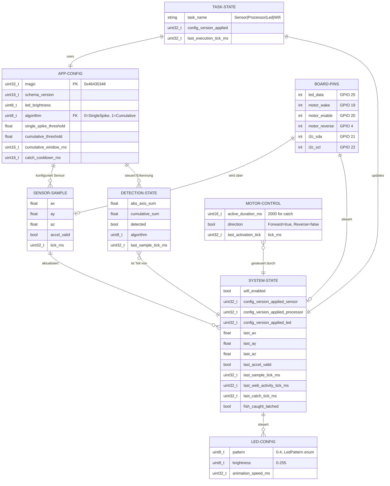

# Fishy Catchy – Entity-Relationship Diagram

Zeigt die Beziehungen zwischen den Datenentitäten und deren Verkettung.

```mermaid
erDiagram
    APP-CONFIG ||--o{ SENSOR-SAMPLE : "konfiguriert Sensor"
    APP-CONFIG ||--o{ DETECTION-STATE : "steuert Erkennung"
    APP-CONFIG {
        uint32_t magic PK "0x46435348"
        uint16_t schema_version
        uint8_t led_brightness
        uint8_t algorithm FK "0=SingleSpike, 1=Cumulative"
        float single_spike_threshold
        float cumulative_threshold
        uint16_t cumulative_window_ms
        uint16_t catch_cooldown_ms
    }
    
    SENSOR-SAMPLE ||--o{ SYSTEM-STATE : "aktualisiert"
    SENSOR-SAMPLE {
        float ax
        float ay
        float az
        bool accel_valid
        uint32_t tick_ms
    }
    
    BOARD-PINS {
        int led_data "GPIO 25"
        int motor_wake "GPIO 19"
        int motor_enable "GPIO 20"
        int motor_reverse "GPIO 4"
        int i2c_sda "GPIO 21"
        int i2c_scl "GPIO 22"
    }
    
    BOARD-PINS ||--o| SENSOR-SAMPLE : "wird über"
    BOARD-PINS ||--o| SYSTEM-STATE : "steuert"
    
    DETECTION-STATE }o--|| SYSTEM-STATE : "ist Teil von"
    DETECTION-STATE {
        float abs_axis_sum
        float cumulative_sum
        bool detected
        uint8_t algorithm
        uint32_t last_sample_tick_ms
    }
    
    SYSTEM-STATE ||--o{ LED-CONFIG : "steuert"
    SYSTEM-STATE {
        bool wifi_enabled
        uint32_t config_version_applied_sensor
        uint32_t config_version_applied_processor
        uint32_t config_version_applied_led
        float last_ax
        float last_ay
        float last_az
        bool last_accel_valid
        uint32_t last_sample_tick_ms
        uint32_t last_web_activity_tick_ms
        uint32_t last_catch_tick_ms
        bool fish_caught_latched
    }
    
    LED-CONFIG {
        uint8_t pattern "0-4, LedPattern enum"
        uint8_t brightness "0-255"
        uint32_t animation_speed_ms
    }
    
    MOTOR-CONTROL {
        uint16_t active_duration_ms "2000 for catch"
        bool direction "Forward=true, Reverse=false"
        uint32_t last_activation_tick "tick_ms"
    }
    
    MOTOR-CONTROL }o--|| SYSTEM-STATE : "gesteuert durch"
    
    TASK-STATE ||--|| APP-CONFIG : "uses"
    TASK-STATE ||--|| SYSTEM-STATE : "updates"
    TASK-STATE {
        string task_name "Sensor|Processor|Led|Wifi"
        uint32_t config_version_applied
        uint32_t last_execution_tick_ms
    }
```
