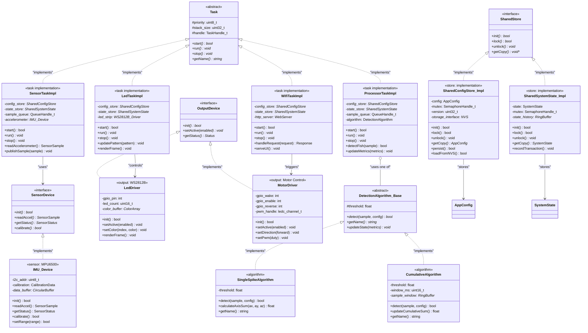

# Fishy Catchy – Vererbungshierarchie & Interface-Struktur

Zeigt logische Vererbungskonzepte und Interface-Strukturen des Projekts.

```mermaid
classDiagram
    direction TB

    %% Base/Interface Konzepte
    class Task {
        <<abstract>>
        #priority: uint8_t
        #stack_size: uint32_t
        #handle: TaskHandle_t
        +start()* bool
        +run()* void
        +stop()* void
        +getName()* string
    }

    class SensorTaskImpl {
        <<task implementation>>
        -config_store: SharedConfigStore*
        -state_store: SharedSystemState*
        -sample_queue: QueueHandle_t
        -accelerometer: IMU_Device*
        +start() bool
        +run() void
        +stop() void
        +readAccelerometer() SensorSample
        +publishSample(sample) void
    }

    class ProcessorTaskImpl {
        <<task implementation>>
        -config_store: SharedConfigStore*
        -state_store: SharedSystemState*
        -sample_queue: QueueHandle_t
        -algorithm: DetectionAlgorithm
        +start() bool
        +run() void
        +stop() void
        +detectFish(sample) bool
        +updateMetrics(metrics) void
    }

    class LedTaskImpl {
        <<task implementation>>
        -config_store: SharedConfigStore*
        -state_store: SharedSystemState*
        -led_strip: WS2812B_Driver*
        +start() bool
        +run() void
        +stop() void
        +updatePattern(pattern) void
        +renderFrame() void
    }

    class WifiTaskImpl {
        <<task implementation>>
        -config_store: SharedConfigStore*
        -state_store: SharedSystemState*
        -http_server: WebServer*
        +start() bool
        +run() void
        +stop() void
        +handleRequest(request) Response
        +serveUI() void
    }

    %% SharedStore Interface
    class SharedStore {
        <<interface>>
        +init()* bool
        +lock()* bool
        +unlock()* void
        +getCopy()* void*
    }

    class SharedConfigStore_Impl {
        <<store: implementation>>
        -config: AppConfig
        -mutex: SemaphoreHandle_t
        -version: uint32_t
        -storage_interface: NVS*
        +init() bool
        +lock() bool
        +unlock() void
        +getCopy() AppConfig*
        +persist() bool
        +loadFromNVS() bool
    }

    class SharedSystemState_Impl {
        <<store: implementation>>
        -state: SystemState
        -mutex: SemaphoreHandle_t
        -state_history: RingBuffer*
        +init() bool
        +lock() bool
        +unlock() void
        +getCopy() SystemState*
        +recordTransaction() void
    }

    %% Sensor Device Interface
    class SensorDevice {
        <<interface>>
        +init()* bool
        +readAccel()* SensorSample
        +getStatus()* SensorStatus
        +calibrate()* bool
    }

    class IMU_Device {
        <<sensor: MPU6500>>
        -i2c_addr: uint8_t
        -calibration: CalibrationData
        -data_buffer: CircularBuffer*
        +init() bool
        +readAccel() SensorSample
        +getStatus() SensorStatus
        +calibrate() bool
        +setRange(range) bool
    }

    %% Output Device Interfaces
    class OutputDevice {
        <<interface>>
        +init()* bool
        +setActive(enabled)* void
        +getStatus()* Status
    }

    class LedDriver {
        <<output: WS2812B>>
        -gpio_pin: int
        -led_count: uint16_t
        -color_buffer: ColorArray*
        +init() bool
        +setActive(enabled) void
        +setColor(index, color) void
        +renderFrame() void
    }

    class MotorDriver {
        <<output: Motor Control>>
        -gpio_wake: int
        -gpio_enable: int
        -gpio_reverse: int
        -pwm_handle: ledc_channel_t
        +init() bool
        +setActive(enabled) void
        +setDirection(forward) void
        +setPwm(duty) void
    }

    %% Algorithmen
    class DetectionAlgorithm_Base {
        <<abstract>>
        #threshold: float
        +detect(sample, config)* bool
        +getName()* string
        +updateState(metrics)* void
    }

    class SingleSpikeAlgorithm {
        <<algorithm>>
        -threshold: float
        +detect(sample, config) bool
        +calculateAxisSum(ax, ay, az) float
        +getName() string
    }

    class CumulativeAlgorithm {
        <<algorithm>>
        -threshold: float
        -window_ms: uint16_t
        -sample_window: RingBuffer*
        +detect(sample, config) bool
        +updateCumulativeSum() float
        +getName() string
    }

    %% Vererbungsbeziehungen
    Task <|.. SensorTaskImpl: "implements"
    Task <|.. ProcessorTaskImpl: "implements"
    Task <|.. LedTaskImpl: "implements"
    Task <|.. WifiTaskImpl: "implements"

    SharedStore <|.. SharedConfigStore_Impl: "implements"
    SharedStore <|.. SharedSystemState_Impl: "implements"

    SensorDevice <|.. IMU_Device: "implements"

    OutputDevice <|.. LedDriver: "implements"
    OutputDevice <|.. MotorDriver: "implements"

    DetectionAlgorithm_Base <|.. SingleSpikeAlgorithm: "implements"
    DetectionAlgorithm_Base <|.. CumulativeAlgorithm: "implements"

    %% Komposition/Aggregation
    ProcessorTaskImpl o-- DetectionAlgorithm_Base: "uses one of"
    
    SensorTaskImpl --> SensorDevice: "uses"
    LedTaskImpl --> LedDriver: "controls"
    WifiTaskImpl --> MotorDriver: "triggers"
    
    SharedConfigStore_Impl --> AppConfig: "stores"
    SharedSystemState_Impl --> SystemState: "stores"

    classDef absClass fill:#e8d5f2,stroke:#7b1fa2,stroke-width:2px,color:#4a148c
    classDef implClass fill:#c8e6c9,stroke:#2e7d32,stroke-width:2px,color:#1b5e20
    classDef interface fill:#b3e5fc,stroke:#0277bd,stroke-width:2px,color:#01579b
    classDef device fill:#ffe0b2,stroke:#e65100,stroke-width:2px,color:#bf360c
```
