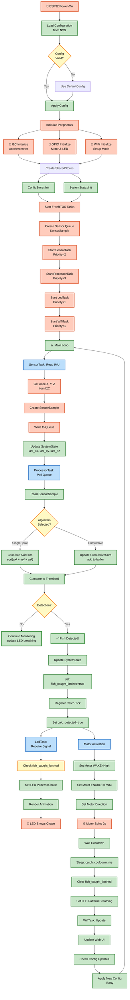

# Fishy Catchy – Aktivitätsdiagramm: Hauptablauf

Zeigt den Aktivitätsfluss vom Start bis zur Fisch-Erkennung und Motor-Aktivierung.

```mermaid
graph TD
    A["🔌 ESP32 Power-On"] --> B["Load Configuration<br/>from NVS"]
    B --> C{Config<br/>Valid?}
    C -->|No| D["Use DefaultConfig"]
    C -->|Yes| E["Apply Config"]
    D --> E
    
    E --> F["Initialize Peripherals"]
    F --> F1["📡 I2C Initialize<br/>Accelerometer"]
    F --> F2["🔌 GPIO Initialize<br/>Motor & LED"]
    F --> F3["📶 WiFi Initialize<br/>Setup Mode"]
    
    F1 --> G["Create SharedStores"]
    F2 --> G
    F3 --> G
    
    G --> H["ConfigStore::Init"]
    G --> I["SystemState::Init"]
    
    H --> J["Start FreeRTOS Tasks"]
    I --> J
    
    J --> J1["Create Sensor Queue<br/>SensorSample"]
    J1 --> J2["Start SensorTask<br/>Priority=2"]
    J2 --> J3["Start ProcessorTask<br/>Priority=3"]
    J3 --> J4["Start LedTask<br/>Priority=1"]
    J4 --> J5["Start WifiTask<br/>Priority=1"]
    
    J5 --> K["📊 Main Loop"]
    
    K --> L["SensorTask: Read IMU"]
    L --> L1["Get AccelX, Y, Z<br/>from I2C"]
    L1 --> L2["Create SensorSample"]
    L2 --> L3["Write to Queue"]
    L3 --> L4["Update SystemState<br/>last_ax, last_ay, last_az"]
    
    L4 --> M["ProcessorTask:<br/>Poll Queue"]
    M --> M1["Read SensorSample"]
    M1 --> M2{Algorithm<br/>Selected?}
    
    M2 -->|SingleSpike| M3["Calculate AxisSum<br/>sqrt(ax² + ay² + az²)"]
    M2 -->|Cumulative| M4["Update CumulativeSum<br/>add to buffer"]
    
    M3 --> M5["Compare to Threshold"]
    M4 --> M5
    
    M5 --> M6{Detection?}
    M6 -->|No| M7["Continue Monitoring<br/>update LED breathing"]
    M6 -->|Yes| M8["✅ Fish Detected!"]
    
    M8 --> N["Update SystemState"]
    N --> N1["Set: fish_caught_latched=true"]
    N1 --> N2["Register Catch Tick"]
    N2 --> N3["Set calc_detected=true"]
    
    N3 --> O["LedTask:<br/>Receive Signal"]
    O --> O1["Check fish_caught_latched"]
    O1 --> O2["Set LED Pattern=Chase"]
    O2 --> O3["Render Animation"]
    O3 --> O4["🎨 LED Shows Chase"]
    
    N3 --> P["Motor Activation"]
    P --> P1["Set Motor WAKE=High"]
    P1 --> P2["Set Motor ENABLE=PWM"]
    P2 --> P3["Set Motor Direction"]
    P3 --> P4["⚙️ Motor Spins 2s"]
    
    P4 --> Q["Wait Cooldown"]
    Q --> Q1["Sleep: catch_cooldown_ms"]
    Q1 --> Q2["Clear fish_caught_latched"]
    Q2 --> Q3["Set LED Pattern=Breathing"]
    
    Q3 --> R["WifiTask: Update"]
    R --> R1["Update Web UI"]
    R1 --> R2["Check Config Updates"]
    R2 --> R3["Apply New Config<br/>if any"]
    
    R3 --> K
    
    classDef io fill:#ffccbc,stroke:#d84315,stroke-width:2px,color:#000
    classDef process fill:#c8e6c9,stroke:#2e7d32,stroke-width:2px,color:#000
    classDef decision fill:#fff9c4,stroke:#f57f17,stroke-width:2px,color:#000
    classDef output fill:#bbdefb,stroke:#1565c0,stroke-width:2px,color:#000
    classDef success fill:#c8e6c9,stroke:#388e3c,stroke-width:3px,color:#000
    
    class A,F,F1,F2,F3,J,J1,J2,J3,J4,J5,L1,L2,L3,L4,O4,P4 io
    class B,E,H,I,K,L,L4,M,M1,M3,M4,M5,N,N1,N2,N3,O,O1,O2,O3,P,P1,P2,P3,Q,Q1,Q2,Q3,R,R1,R2,R3 process
    class C,M2,M6,O1 decision
    class L,M,O,P output
    class M8,M7 success
```
