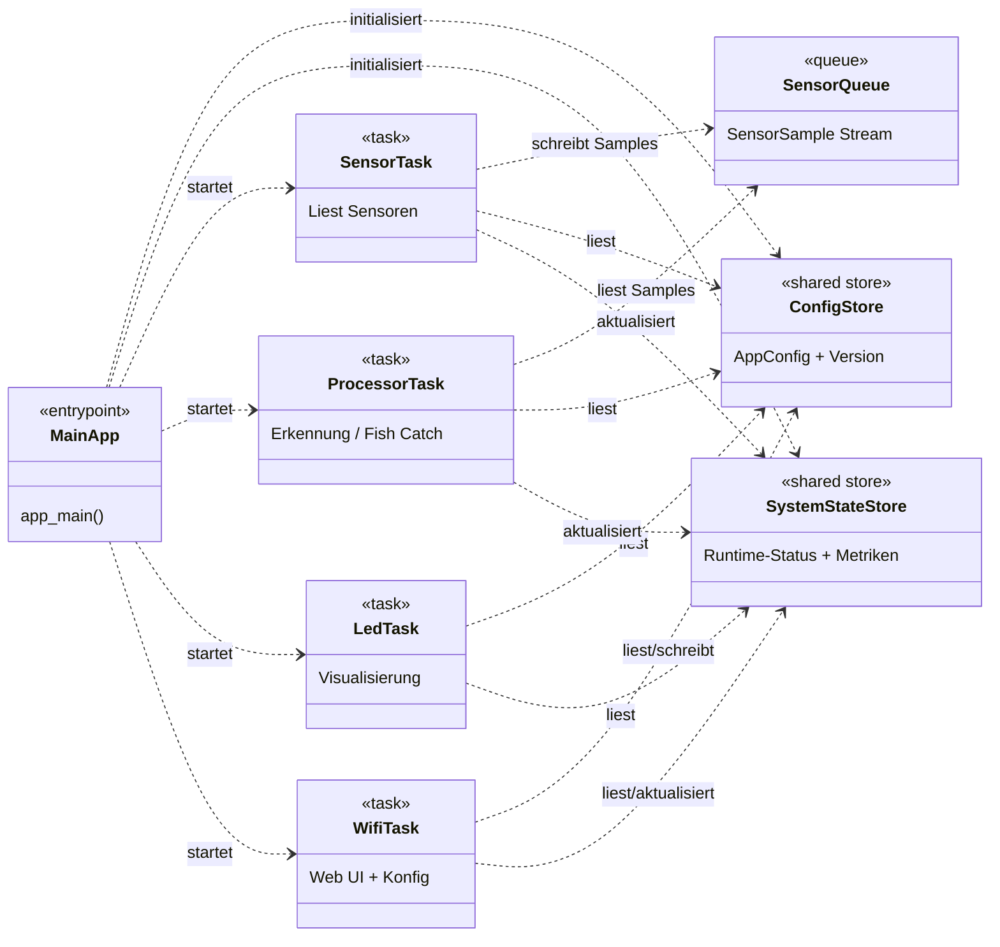

# Fishy Catchy – Klassendiagramm

```mermaid
classDiagram
    direction LR

    class MainApp {
      <<entrypoint>>
      app_main()
    }

    class ConfigStore {
      <<shared store>>
      AppConfig + Version
    }

    class SystemStateStore {
      <<shared store>>
      Runtime-Status + Metriken
    }

    class SensorTask {
      <<task>>
      Liest Sensoren
    }

    class ProcessorTask {
      <<task>>
      Erkennung / Fish Catch
    }

    class LedTask {
      <<task>>
      Visualisierung
    }

    class WifiTask {
      <<task>>
      Web UI + Konfig
    }

    class SensorQueue {
      <<queue>>
      SensorSample Stream
    }

    MainApp ..> ConfigStore : initialisiert
    MainApp ..> SystemStateStore : initialisiert
    MainApp ..> SensorTask : startet
    MainApp ..> ProcessorTask : startet
    MainApp ..> LedTask : startet
    MainApp ..> WifiTask : startet

    SensorTask ..> SensorQueue : schreibt Samples
    ProcessorTask ..> SensorQueue : liest Samples

    SensorTask ..> ConfigStore : liest
    ProcessorTask ..> ConfigStore : liest
    LedTask ..> ConfigStore : liest
    WifiTask ..> ConfigStore : liest/schreibt

    SensorTask ..> SystemStateStore : aktualisiert
    ProcessorTask ..> SystemStateStore : aktualisiert
    LedTask ..> SystemStateStore : liest
    WifiTask ..> SystemStateStore : liest/aktualisiert

    classDef store fill:#fff4e6,stroke:#f08c00,stroke-width:1.5px,color:#663c00
    classDef task fill:#ebfbee,stroke:#2b8a3e,stroke-width:1.5px,color:#1f4d2a
    classDef main fill:#f8f0fc,stroke:#9c36b5,stroke-width:1.5px,color:#4a1f57
    classDef queue fill:#e7f5ff,stroke:#1c7ed6,stroke-width:1.5px,color:#0b3b66
```
